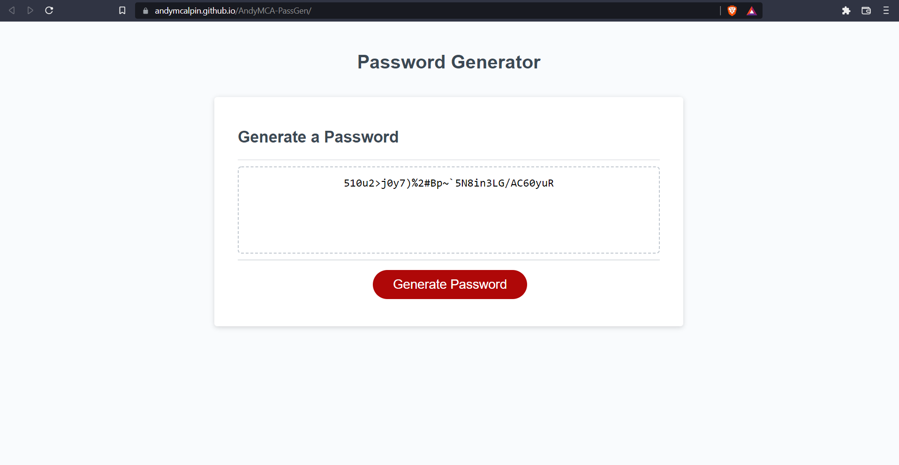

# Andy's Password Generator

Andy's Password Generator is a web-app to make random strong passwords based on user input.

## Installation

This app runs in the browser, either visit https://andymcalpin.github.io/AndyMCA-PassGen/
or download the files from https://github.com/AndyMcAlpin/AndyMCA-PassGen and run index.html in your browser.

## Usage

- Click the Generate Password button.

- Follow the prompts to select length and choice of characters.

- Copy your password from the text box.

## Contributing
Pull requests are welcome. For major changes, please open an issue first to discuss what you would like to change.

## License
[MIT](https://choosealicense.com/licenses/mit/)
